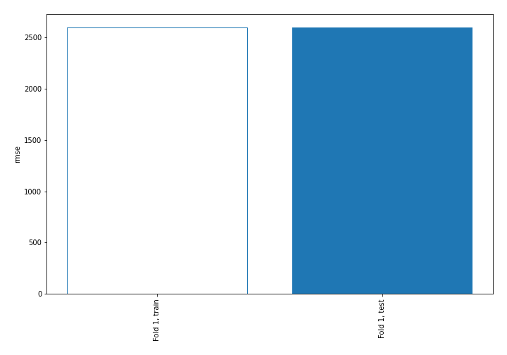
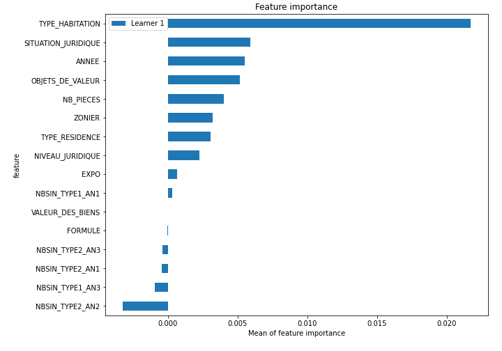
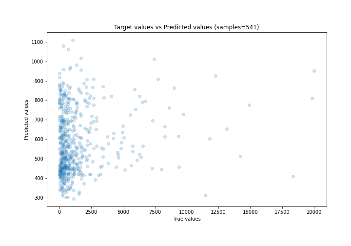
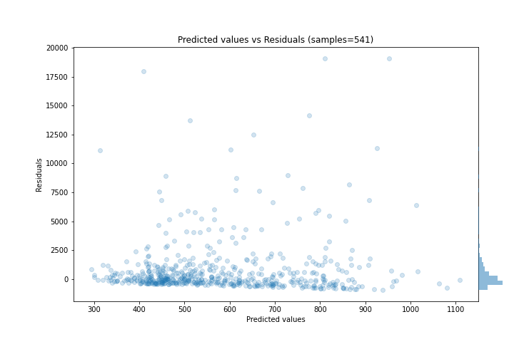
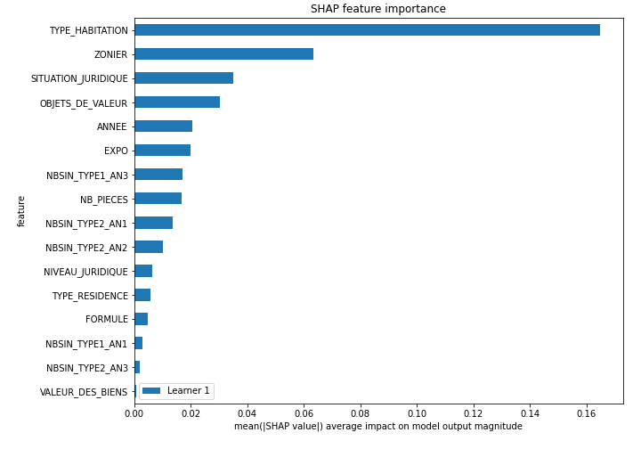
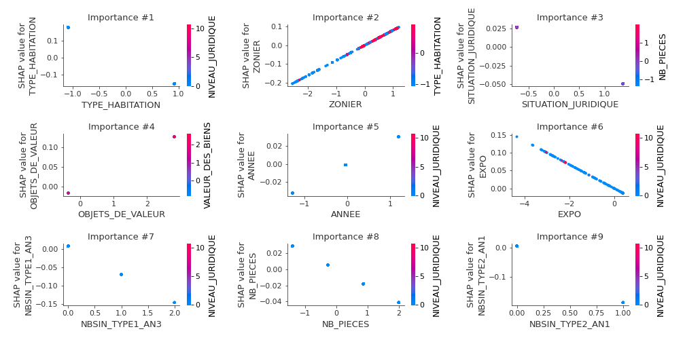
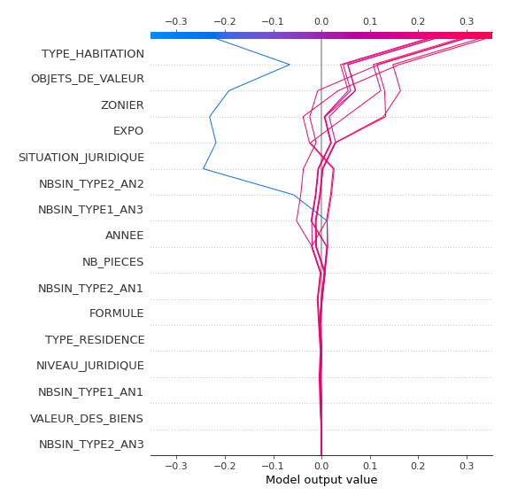
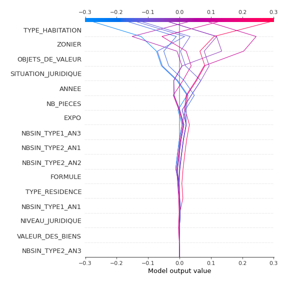

# Summary of 3_Linear

[<< Go back](../README.md)

## Linear Regression (Linear)
- **n_jobs**: -1
- **explain_level**: 2

## Validation
 - **validation_type**: split
 - **train_ratio**: 0.75
 - **shuffle**: True

## Optimized metric
rmse

## Training time

1.5 seconds

### Metric details:
| Metric   |          Score |
|:---------|---------------:|
| MAE      | 1168.54        |
| MSE      |    6.72385e+06 |
| RMSE     | 2593.04        |
| R2       |   -0.103799    |
| MAPE     |    2.62781     |

## Learning curves

## Coefficients
| feature             |   Learner_1 |
|:--------------------|------------:|
| ZONIER              |  0.0802117  |
| OBJETS_DE_VALEUR    |  0.0446209  |
| NBSIN_TYPE2_AN3     |  0.0336549  |
| ANNEE               |  0.0255121  |
| intercept           |  0.0180727  |
| TYPE_RESIDENCE      |  0.0130147  |
| NBSIN_TYPE1_AN1     |  0.0113749  |
| VALEUR_DES_BIENS    | -0.00102148 |
| FORMULE             | -0.00555512 |
| NB_PIECES           | -0.0207456  |
| NIVEAU_JURIDIQUE    | -0.0234203  |
| EXPO                | -0.0331904  |
| SITUATION_JURIDIQUE | -0.0359924  |
| NBSIN_TYPE1_AN3     | -0.0777135  |
| TYPE_HABITATION     | -0.16559    |
| NBSIN_TYPE2_AN2     | -0.192611   |
| NBSIN_TYPE2_AN1     | -0.19472    |

## Permutation-based Importance

## True vs Predicted

## Predicted vs Residuals

## SHAP Importance

## SHAP Dependence plots

### Dependence (Fold 1)

## SHAP Decision plots

### Top-10 Worst decisions (Fold 1)

### Top-10 Best decisions (Fold 1)

[<< Go back](../README.md)
