# Exploratory Data Analysis

[<< Go back](../README.md)
## Feature : target
- **Feature type** : continous
- **Missing** : 0.0%
- **Unique** : 1896
- **Count** :2164.0
- **Mean** :1437.7723382624788
- **Std** :2477.576421548379
- **Min** :5.07
- **25%th Percentile** : 250.4675
- **50%th Percentile** : 626.45
- **75%th Percentile** : 1536.05
- **Max** :33089.12

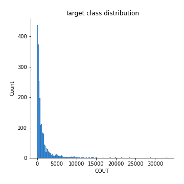
## Feature : EXPO
- **Feature type** : continous
- **Missing** : 0.0%
- **Unique** : 317
- **Count** :2164.0
- **Mean** :0.9260507243020335
- **Std** :0.18663684042572024
- **Min** :0.0191256702
- **25%th Percentile** : 1.0
- **50%th Percentile** : 1.0
- **75%th Percentile** : 1.0
- **Max** :1.0

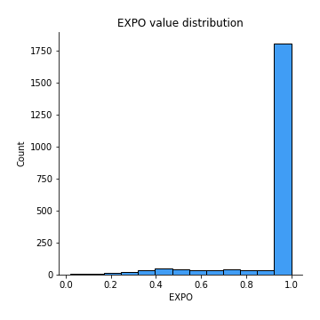
## Feature : FORMULE
- **Feature type** : categorical
- **Missing** : 0.0%
- **Unique** : 4
- **Count** :2164
- **Unique** :4
- **Top** :CONFORT
- **Freq** :1320

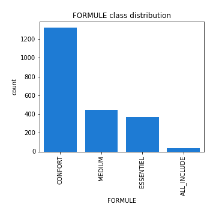
## Feature : TYPE_RESIDENCE
- **Feature type** : categorical
- **Missing** : 0.0%
- **Unique** : 2
- **Count** :2164
- **Unique** :2
- **Top** :PRINCIPALE
- **Freq** :2040

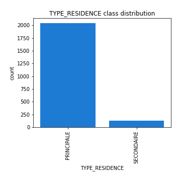
## Feature : TYPE_HABITATION
- **Feature type** : categorical
- **Missing** : 0.0%
- **Unique** : 2
- **Count** :2164
- **Unique** :2
- **Top** :MAISON
- **Freq** :1173

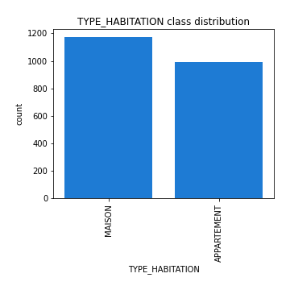
## Feature : NB_PIECES
- **Feature type** : continous
- **Missing** : 5.822550831792976%
- **Unique** : 5
- **Count** :2038.0
- **Mean** :2.2526987242394503
- **Std** :0.9067629384341586
- **Min** :0.0
- **25%th Percentile** : 2.0
- **50%th Percentile** : 2.0
- **75%th Percentile** : 3.0
- **Max** :4.0

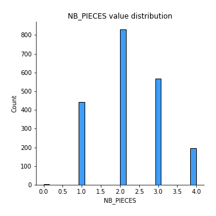
## Feature : SITUATION_JURIDIQUE
- **Feature type** : categorical
- **Missing** : 0.0%
- **Unique** : 2
- **Count** :2164
- **Unique** :2
- **Top** :LOCATAIRE
- **Freq** :1391

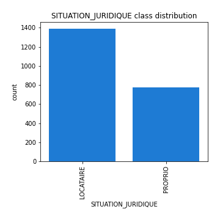
## Feature : NIVEAU_JURIDIQUE
- **Feature type** : categorical
- **Missing** : 0.0%
- **Unique** : 2
- **Count** :2164
- **Unique** :2
- **Top** :JUR1
- **Freq** :2141

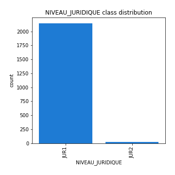
## Feature : VALEUR_DES_BIENS
- **Feature type** : continous
- **Missing** : 0.0%
- **Unique** : 8
- **Count** :2164.0
- **Mean** :22728.974121996303
- **Std** :22278.745121731285
- **Min** :0.0
- **25%th Percentile** : 9000.0
- **50%th Percentile** : 20000.0
- **75%th Percentile** : 35000.0
- **Max** :100000.0

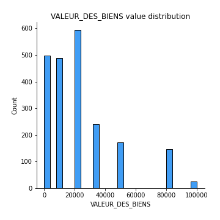
## Feature : OBJETS_DE_VALEUR
- **Feature type** : categorical
- **Missing** : 0.0%
- **Unique** : 2
- **Count** :2164
- **Unique** :2
- **Top** :NIVEAU_1
- **Freq** :1911

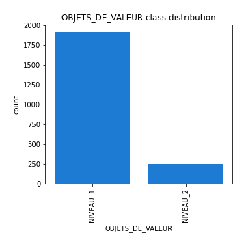
## Feature : ZONIER
- **Feature type** : categorical
- **Missing** : 0.0%
- **Unique** : 65
- **Count** :2164
- **Unique** :65
- **Top** :C20
- **Freq** :319

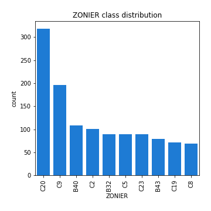
## Feature : NBSIN_TYPE1_AN1
- **Feature type** : discrete
- **Missing** : 0.0%
- **Unique** : 4
- **Count** :2164.0
- **Mean** :0.14186691312384472
- **Std** :0.3866991419503006
- **Min** :0.0
- **25%th Percentile** : 0.0
- **50%th Percentile** : 0.0
- **75%th Percentile** : 0.0
- **Max** :3.0

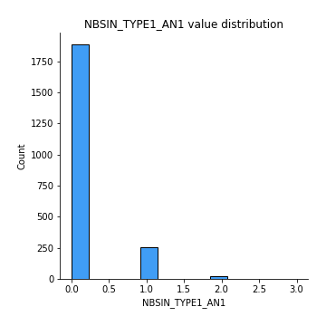
## Feature : NBSIN_TYPE1_AN3
- **Feature type** : discrete
- **Missing** : 0.0%
- **Unique** : 4
- **Count** :2164.0
- **Mean** :0.11829944547134935
- **Std** :0.37471847466635416
- **Min** :0.0
- **25%th Percentile** : 0.0
- **50%th Percentile** : 0.0
- **75%th Percentile** : 0.0
- **Max** :3.0

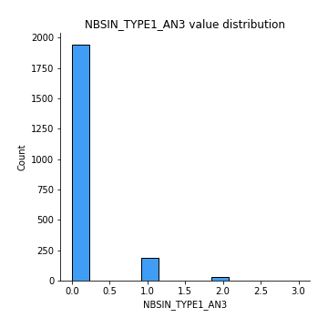
## Feature : NBSIN_TYPE2_AN1
- **Feature type** : discrete
- **Missing** : 0.0%
- **Unique** : 3
- **Count** :2164.0
- **Mean** :0.03373382624768946
- **Std** :0.19296148181592038
- **Min** :0.0
- **25%th Percentile** : 0.0
- **50%th Percentile** : 0.0
- **75%th Percentile** : 0.0
- **Max** :2.0

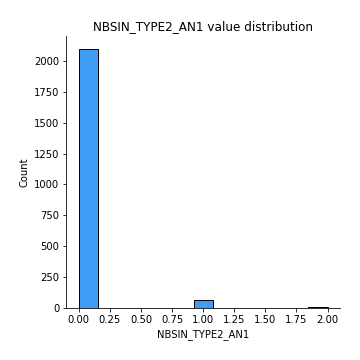
## Feature : NBSIN_TYPE2_AN2
- **Feature type** : continous
- **Missing** : 11.136783733826247%
- **Unique** : 3
- **Count** :1923.0
- **Mean** :0.031201248049921998
- **Std** :0.18266145071131992
- **Min** :0.0
- **25%th Percentile** : 0.0
- **50%th Percentile** : 0.0
- **75%th Percentile** : 0.0
- **Max** :2.0

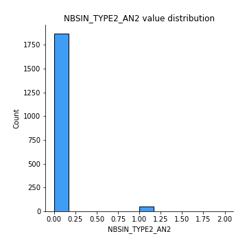
## Feature : NBSIN_TYPE2_AN3
- **Feature type** : discrete
- **Missing** : 0.0%
- **Unique** : 3
- **Count** :2164.0
- **Mean** :0.02634011090573013
- **Std** :0.17401544412354253
- **Min** :0.0
- **25%th Percentile** : 0.0
- **50%th Percentile** : 0.0
- **75%th Percentile** : 0.0
- **Max** :2.0

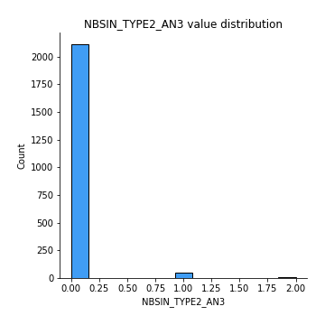
## Feature : ANNEE
- **Feature type** : discrete
- **Missing** : 0.0%
- **Unique** : 3
- **Count** :2164.0
- **Mean** :2017.014325323475
- **Std** :0.8069725948424508
- **Min** :2016.0
- **25%th Percentile** : 2016.0
- **50%th Percentile** : 2017.0
- **75%th Percentile** : 2018.0
- **Max** :2018.0

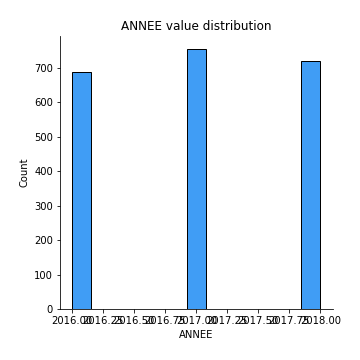

[<< Go back](../README.md)
