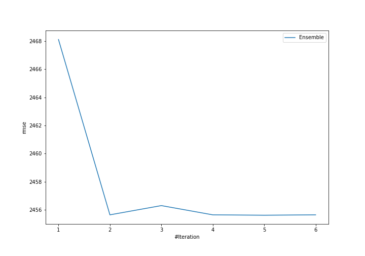
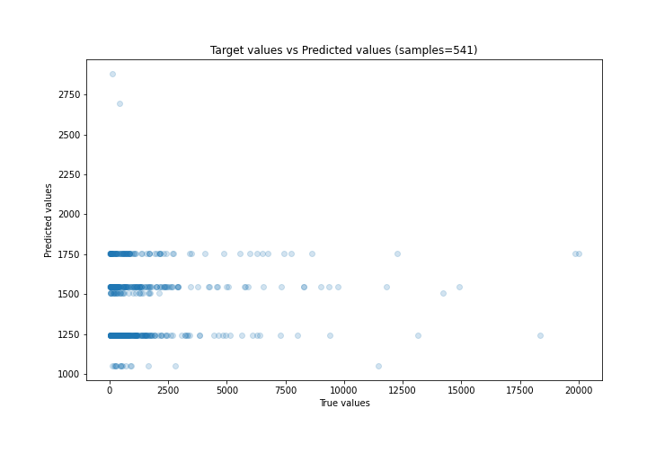
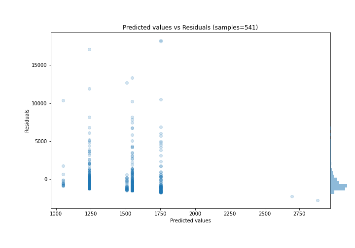

# Summary of Ensemble

[<< Go back](../README.md)

## Ensemble structure
| Model          |   Weight |
|:---------------|---------:|
| 1_Baseline     |        3 |
| 2_DecisionTree |        2 |

### Metric details:
| Metric   |          Score |
|:---------|---------------:|
| MAE      | 1391.05        |
| MSE      |    6.03007e+06 |
| RMSE     | 2455.62        |
| R2       |    0.0100929   |
| MAPE     |    6.64036     |

## Learning curves

## True vs Predicted

## Predicted vs Residuals

[<< Go back](../README.md)
