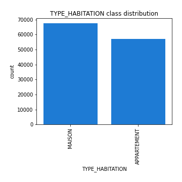
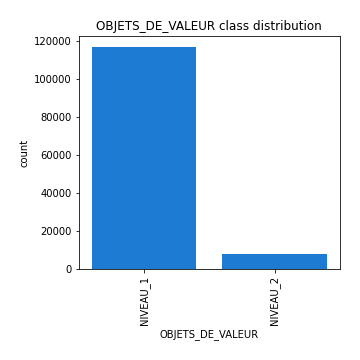

# Exploratory Data Analysis

[<< Go back](../README.md)
## Feature : target
- **Feature type** : continous
- **Missing** : 0.0%
- **Unique** : 2
- **Count** :124520.0
- **Mean** :0.01737873433986508
- **Std** :0.1306784261995869
- **Min** :0.0
- **25%th Percentile** : 0.0
- **50%th Percentile** : 0.0
- **75%th Percentile** : 0.0
- **Max** :1.0

## Feature : EXPO
- **Feature type** : continous
- **Missing** : 0.0%
- **Unique** : 2053
- **Count** :124520.0
- **Mean** :0.8375858268763173
- **Std** :0.29670772001923024
- **Min** :0.0027322397
- **25%th Percentile** : 0.816438194375
- **50%th Percentile** : 1.0
- **75%th Percentile** : 1.0
- **Max** :1.0

## Feature : FORMULE
- **Feature type** : categorical
- **Missing** : 0.0%
- **Unique** : 4
- **Count** :124520
- **Unique** :4
- **Top** :CONFORT
- **Freq** :70125

## Feature : TYPE_RESIDENCE
- **Feature type** : categorical
- **Missing** : 0.0%
- **Unique** : 2
- **Count** :124520
- **Unique** :2
- **Top** :PRINCIPALE
- **Freq** :104570

## Feature : TYPE_HABITATION
- **Feature type** : categorical
- **Missing** : 0.0%
- **Unique** : 2
- **Count** :124520
- **Unique** :2
- **Top** :MAISON
- **Freq** :67545

## Feature : NB_PIECES
- **Feature type** : continous
- **Missing** : 5.989399293286219%
- **Unique** : 5
- **Count** :117062.0
- **Mean** :2.022629034187012
- **Std** :0.9263507578989879
- **Min** :0.0
- **25%th Percentile** : 1.0
- **50%th Percentile** : 2.0
- **75%th Percentile** : 3.0
- **Max** :4.0

## Feature : SITUATION_JURIDIQUE
- **Feature type** : categorical
- **Missing** : 0.0%
- **Unique** : 2
- **Count** :124520
- **Unique** :2
- **Top** :LOCATAIRE
- **Freq** :69199

## Feature : NIVEAU_JURIDIQUE
- **Feature type** : categorical
- **Missing** : 0.0%
- **Unique** : 2
- **Count** :124520
- **Unique** :2
- **Top** :JUR1
- **Freq** :122841

## Feature : VALEUR_DES_BIENS
- **Feature type** : continous
- **Missing** : 0.0%
- **Unique** : 8
- **Count** :124520.0
- **Mean** :16636.540314808866
- **Std** :19532.919875285043
- **Min** :0.0
- **25%th Percentile** : 3500.0
- **50%th Percentile** : 9000.0
- **75%th Percentile** : 20000.0
- **Max** :100000.0

## Feature : OBJETS_DE_VALEUR
- **Feature type** : categorical
- **Missing** : 0.0%
- **Unique** : 2
- **Count** :124520
- **Unique** :2
- **Top** :NIVEAU_1
- **Freq** :116783

## Feature : ZONIER
- **Feature type** : categorical
- **Missing** : 0.0%
- **Unique** : 82
- **Count** :124520
- **Unique** :82
- **Top** :C20
- **Freq** :11657

## Feature : NBSIN_TYPE1_AN1
- **Feature type** : discrete
- **Missing** : 0.0%
- **Unique** : 4
- **Count** :124520.0
- **Mean** :0.07146643109540636
- **Std** :0.28106966117293475
- **Min** :0.0
- **25%th Percentile** : 0.0
- **50%th Percentile** : 0.0
- **75%th Percentile** : 0.0
- **Max** :3.0

## Feature : NBSIN_TYPE1_AN3
- **Feature type** : discrete
- **Missing** : 0.0%
- **Unique** : 4
- **Count** :124520.0
- **Mean** :0.05713138451654353
- **Std** :0.25349518810986243
- **Min** :0.0
- **25%th Percentile** : 0.0
- **50%th Percentile** : 0.0
- **75%th Percentile** : 0.0
- **Max** :3.0

## Feature : NBSIN_TYPE2_AN1
- **Feature type** : discrete
- **Missing** : 0.0%
- **Unique** : 4
- **Count** :124520.0
- **Mean** :0.021410215226469645
- **Std** :0.15451613130442315
- **Min** :0.0
- **25%th Percentile** : 0.0
- **50%th Percentile** : 0.0
- **75%th Percentile** : 0.0
- **Max** :3.0

## Feature : NBSIN_TYPE2_AN2
- **Feature type** : continous
- **Missing** : 10.888210729200129%
- **Unique** : 4
- **Count** :110962.0
- **Mean** :0.01679854364557236
- **Std** :0.13627647422663766
- **Min** :0.0
- **25%th Percentile** : 0.0
- **50%th Percentile** : 0.0
- **75%th Percentile** : 0.0
- **Max** :3.0

## Feature : NBSIN_TYPE2_AN3
- **Feature type** : discrete
- **Missing** : 0.0%
- **Unique** : 4
- **Count** :124520.0
- **Mean** :0.015290716350787022
- **Std** :0.13007767195407505
- **Min** :0.0
- **25%th Percentile** : 0.0
- **50%th Percentile** : 0.0
- **75%th Percentile** : 0.0
- **Max** :3.0

## Feature : ANNEE
- **Feature type** : discrete
- **Missing** : 0.0%
- **Unique** : 3
- **Count** :124520.0
- **Mean** :2016.9672823642788
- **Std** :0.8152663832815702
- **Min** :2016.0
- **25%th Percentile** : 2016.0
- **50%th Percentile** : 2017.0
- **75%th Percentile** : 2018.0
- **Max** :2018.0

[<< Go back](../README.md)
