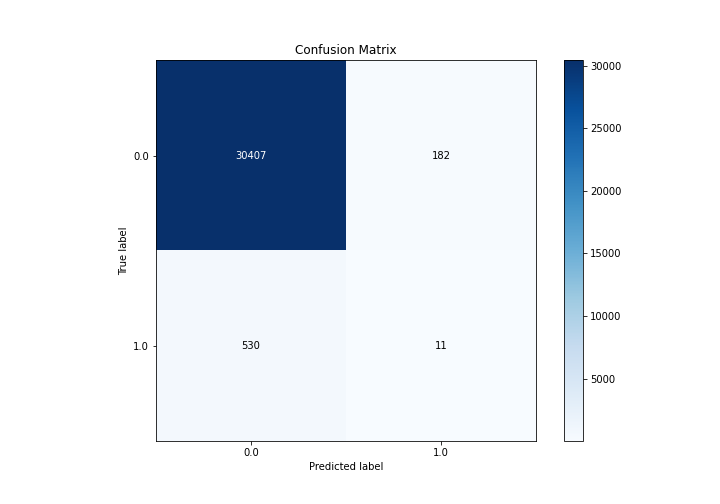

# Summary of Ensemble

[<< Go back](../README.md)

## Ensemble structure
| Model                  |   Weight |
|:-----------------------|---------:|
| 3_Default_Xgboost      |        4 |
| 5_Default_RandomForest |        1 |

## Metric details
|           |     score |     threshold |
|:----------|----------:|--------------:|
| logloss   | 0.0833527 | nan           |
| auc       | 0.698798  | nan           |
| f1        | 0.0769231 |   0.0316346   |
| accuracy  | 0.977128  |   0.0517078   |
| precision | 0.0569948 |   0.0517078   |
| recall    | 1         |   0.000572624 |
| mcc       | 0.0831266 |   0.0204795   |

## Confusion matrix (at threshold=0.051708)
|              |   Predicted as 0 |   Predicted as 1 |
|:-------------|-----------------:|-----------------:|
| Labeled as 0 |            30407 |              182 |
| Labeled as 1 |              530 |               11 |

## Learning curves

## Confusion Matrix

## Normalized Confusion Matrix

## ROC Curve

## Kolmogorov-Smirnov Statistic

## Precision-Recall Curve

## Calibration Curve

## Cumulative Gains Curve

## Lift Curve

[<< Go back](../README.md)
