# Exploratory Data Analysis

[<< Go back](../README.md)
## Feature : target
- **Feature type** : continous
- **Missing** : 0.0%
- **Unique** : 204
- **Count** :379.0
- **Mean** :22.451978891820563
- **Std** :9.298228484605778
- **Min** :5.0
- **25%th Percentile** : 16.9
- **50%th Percentile** : 21.2
- **75%th Percentile** : 25.0
- **Max** :50.0

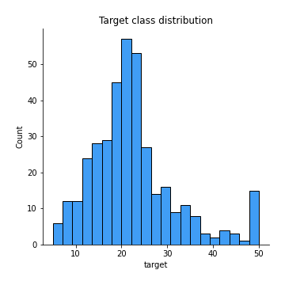
## Feature : CRIM
- **Feature type** : continous
- **Missing** : 0.0%
- **Unique** : 377
- **Count** :379.0
- **Mean** :3.613106279683377
- **Std** :9.010515445545726
- **Min** :0.01301
- **25%th Percentile** : 0.08232500000000001
- **50%th Percentile** : 0.25356
- **75%th Percentile** : 3.6308949999999998
- **Max** :88.9762

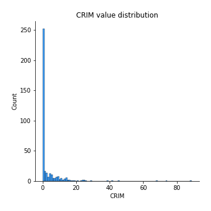
## Feature : ZN
- **Feature type** : continous
- **Missing** : 0.0%
- **Unique** : 25
- **Count** :379.0
- **Mean** :10.757255936675461
- **Std** :22.412656308893098
- **Min** :0.0
- **25%th Percentile** : 0.0
- **50%th Percentile** : 0.0
- **75%th Percentile** : 12.5
- **Max** :100.0

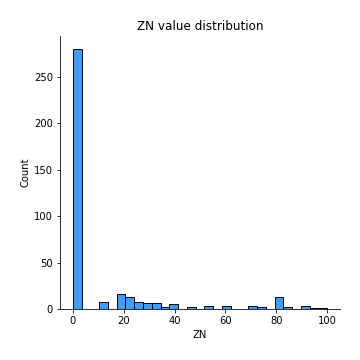
## Feature : INDUS
- **Feature type** : continous
- **Missing** : 0.0%
- **Unique** : 68
- **Count** :379.0
- **Mean** :11.167519788918186
- **Std** :6.875301295678127
- **Min** :0.46
- **25%th Percentile** : 5.19
- **50%th Percentile** : 9.69
- **75%th Percentile** : 18.1
- **Max** :27.74

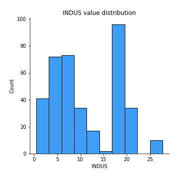
## Feature : CHAS
- **Feature type** : continous
- **Missing** : 0.0%
- **Unique** : 2
- **Count** :379.0
- **Mean** :0.06068601583113457
- **Std** :0.23906908100328664
- **Min** :0.0
- **25%th Percentile** : 0.0
- **50%th Percentile** : 0.0
- **75%th Percentile** : 0.0
- **Max** :1.0

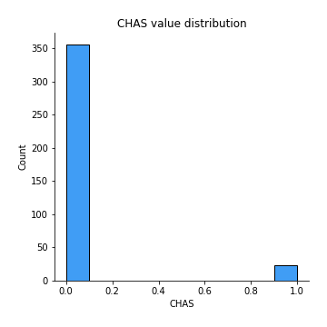
## Feature : NOX
- **Feature type** : continous
- **Missing** : 0.0%
- **Unique** : 78
- **Count** :379.0
- **Mean** :0.5547596306068604
- **Std** :0.11568285592239046
- **Min** :0.392
- **25%th Percentile** : 0.453
- **50%th Percentile** : 0.538
- **75%th Percentile** : 0.624
- **Max** :0.871

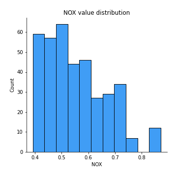
## Feature : RM
- **Feature type** : continous
- **Missing** : 0.0%
- **Unique** : 349
- **Count** :379.0
- **Mean** :6.283593667546172
- **Std** :0.7137077296387067
- **Min** :3.561
- **25%th Percentile** : 5.890000000000001
- **50%th Percentile** : 6.195
- **75%th Percentile** : 6.6185
- **Max** :8.725

## Feature : AGE
- **Feature type** : continous
- **Missing** : 0.0%
- **Unique** : 287
- **Count** :379.0
- **Mean** :68.58839050131925
- **Std** :28.200507937478015
- **Min** :6.0
- **25%th Percentile** : 43.9
- **50%th Percentile** : 77.3
- **75%th Percentile** : 93.69999999999999
- **Max** :100.0

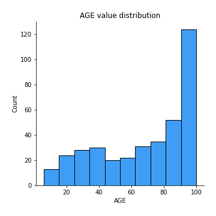
## Feature : DIS
- **Feature type** : continous
- **Missing** : 0.0%
- **Unique** : 321
- **Count** :379.0
- **Mean** :3.7761237467018485
- **Std** :2.106978124094656
- **Min** :1.1691
- **25%th Percentile** : 2.1003499999999997
- **50%th Percentile** : 3.1025
- **75%th Percentile** : 5.1167
- **Max** :12.1265

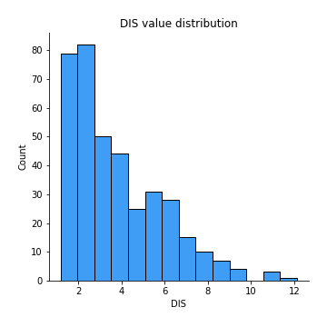
## Feature : RAD
- **Feature type** : continous
- **Missing** : 0.0%
- **Unique** : 9
- **Count** :379.0
- **Mean** :9.461741424802112
- **Std** :8.599279416510806
- **Min** :1.0
- **25%th Percentile** : 4.0
- **50%th Percentile** : 5.0
- **75%th Percentile** : 24.0
- **Max** :24.0

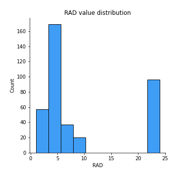
## Feature : TAX
- **Feature type** : continous
- **Missing** : 0.0%
- **Unique** : 60
- **Count** :379.0
- **Mean** :406.28232189973613
- **Std** :168.2674300629547
- **Min** :187.0
- **25%th Percentile** : 279.0
- **50%th Percentile** : 330.0
- **75%th Percentile** : 666.0
- **Max** :711.0

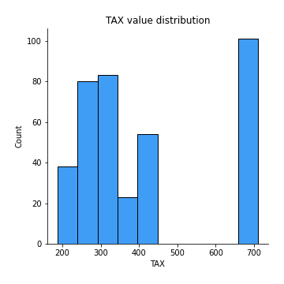
## Feature : PTRATIO
- **Feature type** : continous
- **Missing** : 0.0%
- **Unique** : 43
- **Count** :379.0
- **Mean** :18.45540897097621
- **Std** :2.140140683953995
- **Min** :12.6
- **25%th Percentile** : 17.4
- **50%th Percentile** : 19.0
- **75%th Percentile** : 20.2
- **Max** :22.0

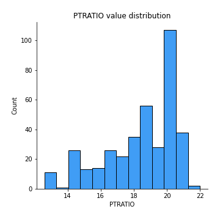
## Feature : B
- **Feature type** : continous
- **Missing** : 0.0%
- **Unique** : 273
- **Count** :379.0
- **Mean** :357.71548812664844
- **Std** :91.54343338686718
- **Min** :0.32
- **25%th Percentile** : 376.71500000000003
- **50%th Percentile** : 392.18
- **75%th Percentile** : 396.22
- **Max** :396.9

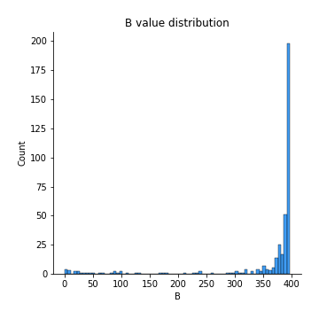
## Feature : LSTAT
- **Feature type** : continous
- **Missing** : 0.0%
- **Unique** : 356
- **Count** :379.0
- **Mean** :12.770158311345643
- **Std** :7.182040098389259
- **Min** :1.73
- **25%th Percentile** : 7.13
- **50%th Percentile** : 11.45
- **75%th Percentile** : 17.115000000000002
- **Max** :36.98

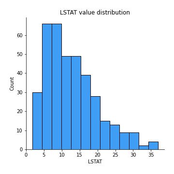

[<< Go back](../README.md)
