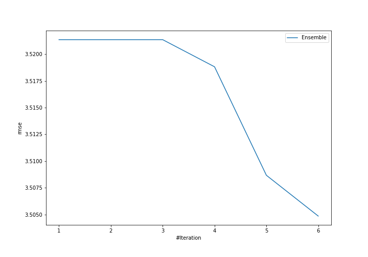
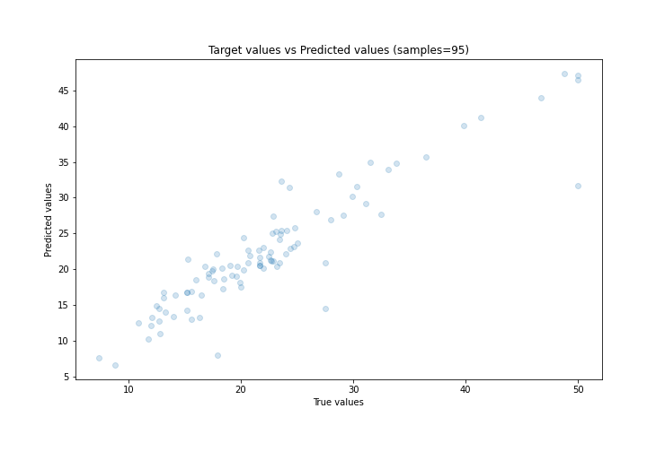
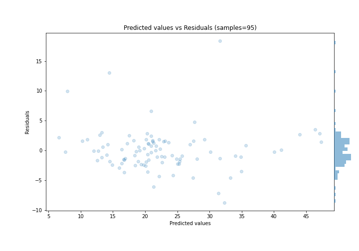

# Summary of Ensemble

[<< Go back](../README.md)

## Ensemble structure
| Model                   |   Weight |
|:------------------------|---------:|
| 4_Default_Xgboost       |        1 |
| 5_Default_NeuralNetwork |        5 |

### Metric details:
| Metric   |     Score |
|:---------|----------:|
| MAE      |  2.27153  |
| MSE      | 12.284    |
| RMSE     |  3.50485  |
| R2       |  0.847486 |
| MAPE     |  0.106134 |

## Learning curves

## True vs Predicted

## Predicted vs Residuals

[<< Go back](../README.md)
