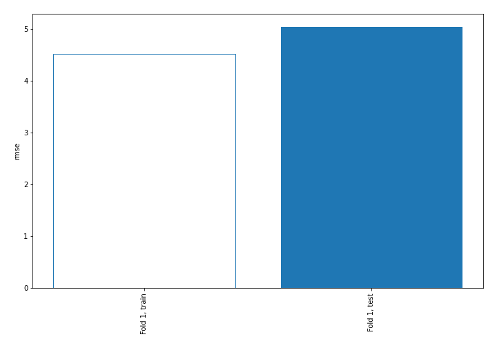
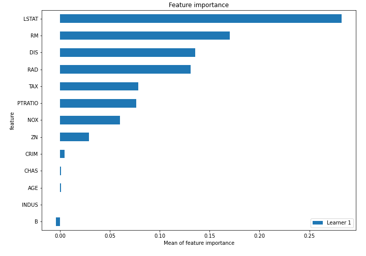
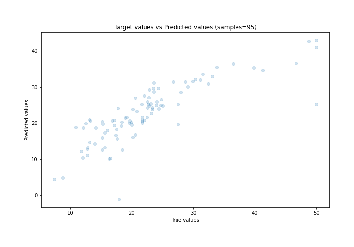
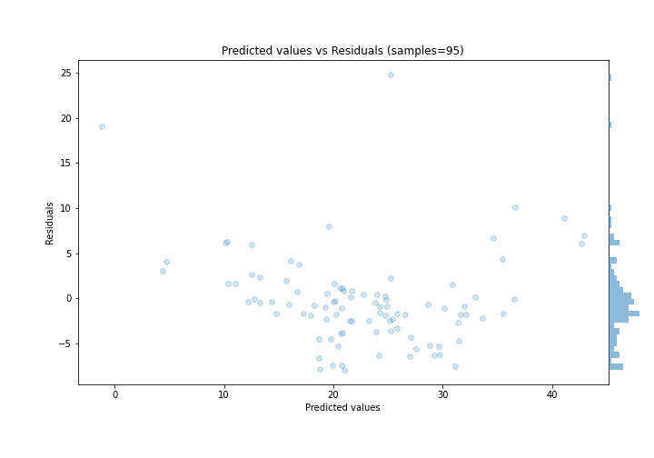
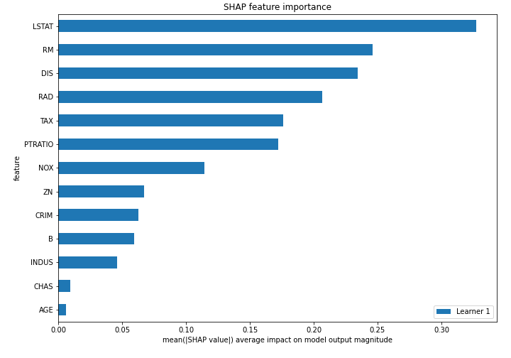
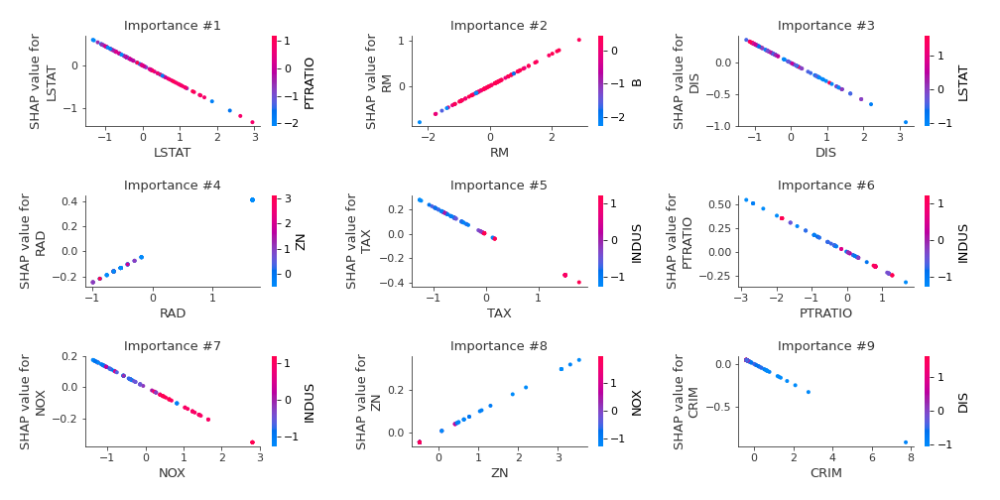
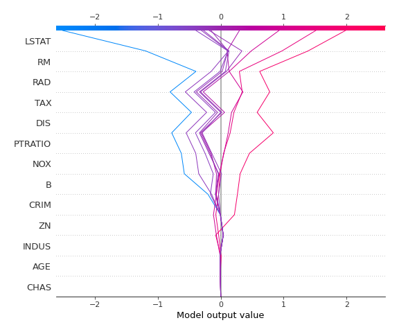
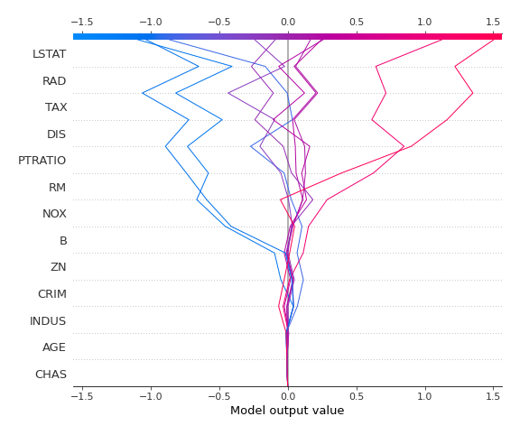

# Summary of 3_Linear

[<< Go back](../README.md)

## Linear Regression (Linear)
- **n_jobs**: -1
- **explain_level**: 2

## Validation
 - **validation_type**: split
 - **train_ratio**: 0.75
 - **shuffle**: True

## Optimized metric
rmse

## Training time

3.0 seconds

### Metric details:
| Metric   |     Score |
|:---------|----------:|
| MAE      |  3.43952  |
| MSE      | 25.4665   |
| RMSE     |  5.04643  |
| R2       |  0.683816 |
| MAPE     |  0.169812 |

## Learning curves

## Coefficients
| feature   |   Learner_1 |
|:----------|------------:|
| RM        |  0.351415   |
| RAD       |  0.247805   |
| B         |  0.106781   |
| ZN        |  0.0963366  |
| CHAS      |  0.0860307  |
| INDUS     |  0.0529975  |
| intercept | -0.00545265 |
| AGE       | -0.00607618 |
| CRIM      | -0.117524   |
| NOX       | -0.126194   |
| PTRATIO   | -0.190825   |
| TAX       | -0.224165   |
| DIS       | -0.297743   |
| LSTAT     | -0.448304   |

## Permutation-based Importance

## True vs Predicted

## Predicted vs Residuals

## SHAP Importance

## SHAP Dependence plots

### Dependence (Fold 1)

## SHAP Decision plots

### Top-10 Worst decisions (Fold 1)

### Top-10 Best decisions (Fold 1)

[<< Go back](../README.md)
